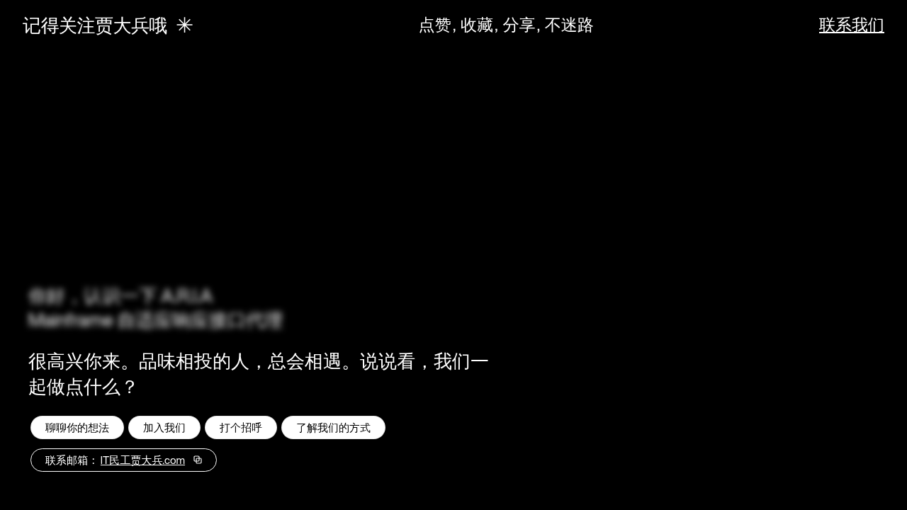

# 3D 人物形象 · 鼠标跟随交互 (3DCharacterMouseFollow)

> 一个全屏交互式 Hero 页面：横向移动鼠标即可在背景视频上前进 / 后退，配合打字机文案、模糊标签、胶囊按钮与一键复制邮箱的微交互。


---

## ✨ 在线体验

**👉 立即体验：<https://jdb156158.github.io/3DCharacterMouseFollow/>**

> 打开后请在页面任意位置**左右移动鼠标**，即可感受到背景视频随指针横向 scrub 的效果；移动端可横向拖动屏幕。

### PNG 预览



> *（预览图捕获于背景视频尚未解码完成的瞬间，主视觉以线上效果为准）*

---

## 📖 项目简介

`3DCharacterMouseFollow` 是一个**单文件**的交互式着陆页原型：

- **整页 `<video>` 作为背景**，`position: fixed; inset: 0; object-fit: cover; object-position: 70% center;`。
- **不自动播放**，而是由鼠标在窗口中的横向位移来 **scrub `video.currentTime`**：
  `timeDelta = (deltaX / window.innerWidth) * 0.8 * video.duration`。
- 使用 `seekingRef` + `seeked` 事件做**防抖队列**，避免高频 seek 引发"非单调索引"或丢帧。
- Hero 区域叠加：模糊的"产品名"标签 → 打字机主文案（自定义 `useTypewriter` 钩子，含闪烁光标）→ 胶囊操作按钮（fade-in + slide-up 动画）。
- 内置**复制邮箱**胶囊（白底/黑字、outline 描边、带 `CopyIcon`），点击调用 `navigator.clipboard.writeText`，1.6s 反馈"已复制！"。
- 导航栏桌面端为"Logo + 链接 + CTA"，移动端折叠为汉堡菜单 → **毛玻璃全屏覆盖**（`backdrop-filter: blur(12px)` + `rgba(0,0,0,0.9)`）。

> ⚠️ 注：仓库标题为「3D 人物形象鼠标跟随」源于最初的创意方向（跟随鼠标产生 3D 角色视差感）；实际落地为"**全屏视频 scrub + 鼠标交互**"方案。如需替换为真正的 3D 模型（GLTF / `<model-viewer>`），结构已预留好 `BackgroundVideo` 的位置，仅替换该组件即可。

---

## 🎬 核心交互一览

| 模块 | 实现要点 |
| --- | --- |
| **鼠标 scrub 视频** | `window.mousemove` → 计算 `deltaX` → 累加 `targetTime` → `video.currentTime = clamped`；`seekingRef` + `seeked` 回调做防抖 |
| **触摸 scrub** | `touchstart` / `touchmove` 同步复用同一 `trySeek`，移动端可横拖试玩 |
| **打字机文案** | `useTypewriter(text, speed=38, startDelay=600)` 钩子，`setInterval` 逐字累加，结束态 `done=true` |
| **闪烁光标** | `inline-block w-[2px] h-[1.1em] bg-white`，`@keyframes blink` `1s step-end infinite`，`done` 后移除 |
| **胶囊入场** | `.pill-enter`：`opacity 0→1`、`translateY(8px)→0`，`transition: .4s ease`，页面加载 400ms 后加 `is-visible` |
| **复制邮箱** | `navigator.clipboard.writeText()` → 切换 `copied` 状态 1.6s |
| **汉堡菜单** | 三条 `w-6 h-[2px] bg-white` 横线，点击后第 1/3 条旋转 ±45° 居中、第 2 条淡出 |
| **移动端全屏覆盖** | `fixed inset-0 bg-black/90 backdrop-blur-md`，`flex-col justify-center px-8 gap-8` |
| **响应式字体** | `clamp(18px, 4vw, 26px)`，桌面 `font-heading` (Helvetica Now Display Medium) + 正文 `font-body` |

---

## 🛠 技术栈

- **React 18**（UMD，CDN 引入，`umd/react.production.min.js`）
- **ReactDOM 18**（CDN）
- **@babel/standalone 7.29**（浏览器端即时编译 JSX，零构建）
- **Tailwind CSS**（Play CDN，`tailwind.config` 内联定制 `fontFamily`）
- **Helvetica Now Display**（`onlinewebfonts.com` 远程样式表）
- 背景视频：CloudFront 托管的 MP4（`muted` / `playsInline` / `preload="auto"`）

> 整个项目**无任何打包步骤**，双击 `index.html` 即可运行。

---

## 📁 文件结构

```text
3DCharacterMouseFollow/
├── index.html        # 入口：CDN + 内联样式 + Babel 编译的 React 组件
├── app.jsx           # 与 index.html 中 <script type="text/babel"> 同步的源码副本
├── thumbnail.png     # README 预览图
├── README.md         # 本文件
└── .gitignore        # 忽略 macOS 元数据（._* / .DS_Store）及其他
```

> 部署到 **GitHub Pages** 时只会用到 `index.html` 与 `thumbnail.png`，`app.jsx` 仅作为源码可读副本保留。

---

## 🚀 本地运行

任选其一：

```bash
# 方式 1：直接打开
open index.html        # macOS
# 或双击 index.html
```

```bash
# 方式 2：起一个本地静态服务（推荐，避免某些浏览器对 file:// 的限制）
python3 -m http.server 8000
# 浏览器访问 http://localhost:8000
```

```bash
# 方式 3：Node 简易服务
npx serve .
```

---

## ☁️ 部署到 GitHub Pages

本仓库已配置为从 `main` 分支根目录发布。

1. 提交并推送 `index.html` / `thumbnail.png` / `README.md` / `app.jsx` / `.gitignore` 到 `main`。
2. 在 GitHub 仓库 `Settings → Pages` 中，`Source` 选择 **Deploy from a branch**，分支选 `main`、目录选 `/ (root)`。
3. 等待 1–2 分钟构建完成后，访问：<https://jdb156158.github.io/3DCharacterMouseFollow/>

> 之后每次 `git push` 到 `main`，Pages 都会自动重新构建并发布。

---

## 📝 一键复刻提示词（Replication Prompt）

> 以下提示词可直接复制给任意支持 React + Tailwind 的 AI，一键产出同款页面：

```text
Build a full-screen hero landing page for a creative agency called "Mainframe" using React, TypeScript, Vite, and Tailwind CSS. Here is every detail:

FONTS
Load two fonts in `index.html` via these stylesheet links:

- Heading: https://db.onlinewebfonts.com/c/5ac3fe7c6abd2f62067f266d89671492?family=HelveticaNowDisplay-Medium
- Body:    https://db.onlinewebfonts.com/c/1aa3377e489837a26d019bba501e779d?family=HelveticaNowDisplayW01-Rg

In `index.css`, define CSS variables:
:root {
  --font-heading: 'HelveticaNowDisplay-Medium', 'Helvetica Neue', Arial, sans-serif;
  --font-body:    'HelveticaNowDisplayW01-Rg',  'Helvetica Neue', Arial, sans-serif;
}
body { font-family: var(--font-body); }

The entire page uses var(--font-body) except the logo text which uses var(--font-heading).

BACKGROUND VIDEO (mouse-scrub controlled)
- A full-screen <video> element is position: fixed; inset: 0; z-index: 0; object-fit: cover; object-position: 70% center;.
- Video source URL: https://d8j0ntlcm91z4.cloudfront.net/user_38xzZboKViGWJOttwIXH07lWA1P/hf_20260826_041744_63efcd78-bf7d-4039-99e2-2461e8a61903.mp4
- The video is muted, playsInline, preload="auto". It does NOT autoplay.
- The video scrubs forward/backward based on horizontal mouse movement. Use a mousemove event listener on window. Track prevX, compute delta = currentX - prevX, convert to a time offset:
  (delta / window.innerWidth) * SENSITIVITY * video.duration    // SENSITIVITY = 0.8
  Clamp targetTime between 0 and video.duration. Use video.currentTime to seek, and an onSeeked handler to queue the next seek if targetTime has moved, preventing seek-flooding.

NAVBAR (fixed, z-index: 10)
- Fixed to top, full width. Padding: px-5 sm:px-8 py-4 sm:py-5. Flex row, justify-between, items-center.
- Logo (left): "Mainframe®" at text-[21px] sm:text-[26px] tracking-tight, white, var(--font-heading). Beside it, an asterisk ✳︎ at text-[25px] sm:text-[30px], white, select-none.
- Desktop nav (center, hidden below md): text-[23px], white. "Labs", "Studio", "Openings", "Shop" separated by commas ", ". hover:opacity-60 transition-opacity.
- Desktop CTA (right, hidden below md): "Get in touch" at text-[23px] white underline underline-offset-2.
- Mobile hamburger (below md): 3 bars (w-6 h-[2px] bg-white), gap-[5px]. Toggle: top bar rotate(45deg) translateY(7px), middle fade out, bottom rotate(-45deg) translateY(-7px). duration-300.
- Mobile overlay (z-index: 9): fixed inset-0 bg-black/90 backdrop-blur-md, flex-col justify-center, px-8 gap-8. Same links at text-[32px] font-medium + "Get in touch" underlined.

HERO SECTION (z-index: 1)
- Full h-screen, flex-col. Mobile: justify-end pb-12. md: justify-center pb-0. px-5 sm:px-8 md:px-10. overflow-hidden.
- Content: max-w-xl, relative z-10.
1) Blurred intro label: pointer-events-none select-none mb-5 sm:mb-6, clamp(18px,4vw,26px) line-height 1.3, white, filter: blur(4px). Two lines:
   "Hey there, meet A.R.I.A,"
   "Mainframe's Adaptive Response Interface Agent"
   Separated by <br>.
2) Typewriter text: "Glad you stopped in. Good taste tends to find us. Now, what are we building?"
   - useTypewriter(text, speed=38, startDelay=600) → {displayed, done}.
   - <p> white, mb-5 sm:mb-6, clamp(18px,4vw,26px), line-height 1.35, font-weight 400, min-height 54px.
   - Blinking cursor while typing: inline-block w-[2px] h-[1.1em] bg-white align-middle ml-[2px], @keyframes blink (opacity 1→0→1) 1s step-end infinite. Hidden when done.
3) Action pills (appear 400ms after load, independent of typing):
   - Container: flex flex-wrap gap-y-1.
   - 4 white pills: "Pitch us an idea", "Come work here", "Send a brief hello", "See how we operate".
     inline-flex items-center justify-center bg-white text-black border border-black/10 rounded-full
     text-[13px] sm:text-[15px] px-4 sm:px-5 py-[0.3em] mx-[0.2em] mb-[0.4em] whitespace-nowrap
     hover:bg-black hover:text-white transition-colors duration-200.
   - 1 outline pill: "Reach us: hello@mainframe.co" (email underlined) + 12x12 copy icon (two overlapping rects SVG).
     text-white bg-transparent border border-white rounded-full, same sizing, gap-2 sm:gap-3.
     hover:bg-white hover:text-black. On click: navigator.clipboard.writeText(email).

DEPENDENCIES
Only React, ReactDOM, Tailwind CSS, and Vite. No other UI libraries.
```

---

## 📜 License

MIT — feel free to fork, modify, and ship your own version.
